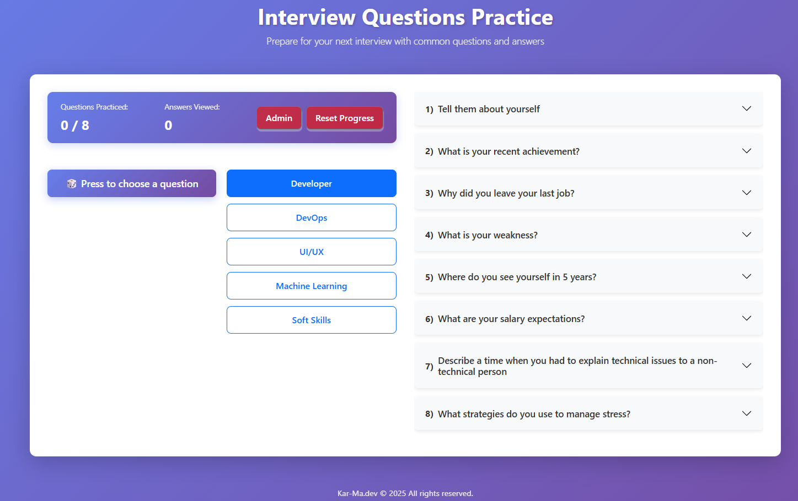

# 🎯 Interview Questions Practice App

A modern, interactive web application designed to help you prepare for technical interviews across multiple domains. Practice randomly selected questions, track your progress, and manage your own question bank with an intuitive admin panel.

---

## 📋 Table of Contents

- [Features](#-features)
- [Demo](#-demo)
- [Installation](#-installation)
- [Usage](#-usage)
- [Admin Panel](#-admin-panel)
- [Project Structure](#-project-structure)
- [Technologies](#-technologies)
- [Contributing](#-contributing)
- [License](#-license)

---

## ✨ Features

### 🎲 **Question Practice**
- **Random Question Generator**: Roll the dice to get a random interview question
- **5 Categories**: Developer, DevOps, UI/UX, Machine Learning, Soft Skills
- **Timer**: Track how long you take to answer each question
- **Progress Tracking**: Monitor questions practiced and answers viewed
- **History Badges**: Visual indicators of questions you've practiced

### 📝 **Admin Panel**
- **Password Protected**: Secure access with password authentication
- **Full CRUD Operations**: Add, Edit, Delete questions
- **Category Management**: Organize questions by category
- **LocalStorage**: All changes saved locally in your browser
- **Visual Editor**: User-friendly interface for managing questions

### 🎨 **UI/UX**
- **Responsive Design**: Works on desktop, tablet, and mobile
- **Dark/Light Mode Support**: Automatic theme detection
- **Toast Notifications**: Non-intrusive success/error messages
- **Smooth Animations**: Shake effects, smooth scrolling, transitions
- **Accordion View**: Browse all questions in an organized list

### 🔧 **Developer Features**
- **Component-Based Architecture**: Modular, reusable components
- **Custom Hooks**: Clean separation of logic
- **Error Boundaries**: Graceful error handling
- **Performance Optimized**: Memoized components
- **TypeScript Ready**: Easy migration path

---

## 🚀 Demo

🔗 **[Live Demo](https://interview-exam-training-app.netlify.app/)** 

### Screenshots

#### Main Interface
 

#### Admin Panel

---

## 📦 Installation

### Prerequisites

- **Node.js** (v16 or higher)
- **npm** or **yarn**

### Steps

1. **Clone the repository**
git clone https://github.com/karmartir/interview-exam-training-app.git
cd interview-questions-app

2. **Install dependencies**
npm install

3. **Start the development server**
npm start

4. **Open in browser**
http://localhost:3000

5. **Build for production**
npm run build

---

## 🎮 Usage

### Basic Usage

1. **Select a Category**: Choose from Developer, DevOps, UI/UX, ML, or Soft Skills
2. **Roll the Dice**: Click the "🎲 Press to choose a question" button
3. **Start Timer**: Hit the ▶ Start button when you're ready to answer
4. **Show Answer**: Click "Show Answer" when you want to see the solution
5. **Track Progress**: View your practice history and statistics

### Keyboard Shortcuts

- **Enter**: Submit password in Admin Panel (when focused on input)

### Progress Tracking

- **Questions Practiced**: Total unique questions you've attempted
- **Answers Viewed**: Count of how many answers you've revealed
- **History Badges**: Visual tags showing which questions you've practiced

---

## 🔐 Admin Panel

### Accessing Admin Panel

1. Click the **"Admin"** button in the top-right corner
2. Enter password: `1234` *(default - change in `src/constants/categories.js`)*
3. Access granted ✓

### Managing Questions

#### ➕ Add New Question
1. Select a category tab
2. Click **"➕ Add New Question"**
3. Fill in the question and answer fields
4. Click **"✓ Done Editing"**
5. Click **"💾 Save All Changes"**

#### ✏️ Edit Existing Question
1. Find the question card
2. Click **"✏️ Edit"**
3. Modify the text
4. Click **"✓ Done Editing"**
5. Click **"💾 Save All Changes"**

#### 🗑️ Delete Question
1. Find the question card
2. Click **"🗑️ Delete"**
3. Confirm deletion
4. Click **"💾 Save All Changes"**

#### 🔄 Reset to Default
- Click **"🔄 Reset to Default"** to restore original questions
- Then click **"💾 Save All Changes"** to apply

### ⚠️ Important Notes

- All changes are saved in **browser's localStorage**
- Clearing browser data **will delete your changes**
- Each browser/device has **separate data**
- Changes are **not shared** between users or devices

---

## 🕵️ Hidden Feature - Data Source Toggle

There's a secret feature to switch between two data sources!

### How to Activate

1. Click the **"e"** in "Practic**e**" (in the main header) **3 times**
2. You'll see exclamation marks appear: "Practice!"
3. After 3 clicks, data source switches to `my_questionsData.js`
4. Click the **"e"** again (even once) to switch back

### Why Use This?

- Keep two separate question banks (e.g., personal vs. public)
- Switch between beginner and advanced questions
- Maintain different question sets for different purposes

### Creating Custom Data Source

Edit `src/my_questionsData.js`:

export const interviewQuestions = {
developer: [
{
id: 0,
question: "Your custom question",
answer: "Your custom answer"
}
],
// Add more categories...
};

---
## 🔐 Environment Variables

This project uses environment variables for sensitive data.

### Local Development

1. **Create `.env` file** in the project root:
cp .env.example .env

2. **Edit `.env`** with your values:
REACT_APP_ADMIN_PASSWORD=your_password_here

3. **Restart dev server** to apply changes:
npm start

### Production (Netlify)

1. Go to **Site settings** → **Build & deploy** → **Environment**
2. Add the following variables:
- `REACT_APP_ADMIN_PASSWORD` - Your admin password
- `REACT_APP_SECRET_CLICK_COUNT` - Number of clicks for secret feature (default: 3)
- `REACT_APP_NAME` - App name
- `REACT_APP_AUTHOR` - Your name/company

### Available Variables

| Variable | Description | Default |
|----------|-------------|---------|
| `REACT_APP_ADMIN_PASSWORD` | Admin panel password | `1234` |
| `REACT_APP_SECRET_CLICK_COUNT` | Clicks to toggle data source | `3` |
| `REACT_APP_NAME` | Application name | `Interview Questions Practice` |
| `REACT_APP_AUTHOR` | Author name | `Kar-ma.dev` |
| `REACT_APP_TOAST_SUCCESS_DURATION` | Success toast duration (ms) | `2000` |
| `REACT_APP_TOAST_ERROR_DURATION` | Error toast duration (ms) | `3000` |
| `REACT_APP_TOAST_INFO_DURATION` | Info toast duration (ms) | `2000` |

### ⚠️ Important Notes

- **Never commit `.env`** to GitHub (already in `.gitignore`)
- **Use `.env.example`** as a template for other developers
- **Restart dev server** after changing `.env` values
- **Re-deploy on Netlify** after changing environment variables

## 📁 Project Structure

rc/
├── components/
│ ├── AdminPanel/
│ │ ├── AdminPanel.js # Main admin component
│ │ ├── AdminPanel.css # Admin styles
│ │ ├── PasswordModal.js # Password authentication
│ │ ├── InstructionsAlert.js # Help banner
│ │ ├── CategoryTabs.js # Category selection
│ │ ├── QuestionCard.js # Individual question card
│ │ ├── QuestionEditor.js # Edit form
│ │ ├── AdminFooter.js # Action buttons
│ │ └── index.js # Clean export
│ │
│ ├── Header.js # App header with secret button
│ ├── Footer.js # App footer
│ ├── ProgressTracker.js # Stats display
│ ├── RollButton.js # Random question button
│ ├── CategoryButtons.js # Category selector
│ ├── SelectedQuestionDisplay.js # Current question display
│ ├── TimerControls.js # Timer + Show Answer
│ ├── AnswerCard.js # Answer display
│ ├── QuestionHistory.js # Practice history badges
│ ├── QuestionAccordion.js # Right-side question list
│ └── ErrorBoundary.js # Error handling
│
├── hooks/
│ ├── useDataSource.js # Data source switching logic
│ ├── useTimer.js # Timer logic
│ ├── useQuestionManager.js # Question selection & history
│ └── useAdminQuestions.js # Admin CRUD operations
│
├── constants/
│ ├── categories.js # Category definitions
│ └── toastConfig.js # Toast notification settings
│
├── utils/
│ └── formatTime.js # Time formatting utility
│
├── App.js # Main app component
├── App.css # Global styles
├── questionsData.js # Default question bank
├── my_questionsData.js # Alternative question bank
└── index.js # App entry point

---

## 🛠️ Technologies

### Core
- **React** 19.2.0 - UI library
- **React Bootstrap** 2.10.10 - UI components
- **Bootstrap** 5.3.8 - CSS framework

### Libraries
- **React Toastify** - Toast notifications
- **React Hooks** - State management

### Development
- **Create React App** - Build tooling
- **ES6+** - Modern JavaScript
- **CSS3** - Styling with CSS variables

### Hosting
- **Netlify** - Deployment platform *(or your choice)*

---

## 🎨 Customization

### Change Admin Password

Edit `src/constants/categories.js`:

export const ADMIN_PASSWORD = "your-new-password";

### Add New Category

Edit `src/constants/categories.js`:

export const CATEGORIES = [
// ... existing categories
{ key: "yourcategory", label: "Your Category" },
];

Then add questions in `src/questionsData.js`:

export const interviewQuestions = {
// ... existing categories
yourcategory: [
{ id: 0, question: "Question?", answer: "Answer." }
]
};

### Customize Colors

Edit CSS variables in `src/App.css`:

### Customize Colors

Edit CSS variables in `src/App.css`:

:root {
--color-primary: #your-color;
--color-background: #your-color;
/* ... more variables */
}

---

## 🤝 Contributing

Contributions are welcome! Here's how you can help:

1. **Fork the repository**
2. **Create a feature branch**

git checkout -b feature/AmazingFeature

3. **Commit your changes**
git commit -m 'Add some AmazingFeature'

4. **Push to the branch**
git push origin feature/AmazingFeature

5. **Open a Pull Request**

### Development Guidelines

- Write clean, readable code
- Follow existing code style
- Add comments for complex logic
- Test your changes thoroughly
- Update README if needed

---

## 🐛 Known Issues

- LocalStorage limitation: ~5-10MB storage
- Browser-specific storage (not synced across devices)
- Password stored in plain text (client-side only)

### Planned Features

- [ ] Export/Import question banks (JSON)
- [ ] Cloud sync (Firebase/Supabase)
- [ ] Multiple user accounts
- [ ] Question difficulty levels
- [ ] Statistics dashboard
- [ ] Spaced repetition algorithm
- [ ] Audio pronunciation for questions
- [ ] Code syntax highlighting in answers

---

## 📝 License

This project is licensed under the **MIT License** - see the [LICENSE](LICENSE) file for details.

---

## 👤 Author

**Kar-ma.dev**

- Website: [Kar-ma.dev](https://kar-ma.dev)
- GitHub: [@yourusername](https://github.com/yourusername)

---

## 🙏 Acknowledgments

- React Bootstrap team for amazing UI components
- React community for best practices
- All contributors who help improve this project

---

## 📞 Support

If you have questions or need help:

1. **Check existing issues** on GitHub
2. **Open a new issue** with detailed description
3. **Contact**: [your-email@example.com]

---

## ⭐ Show Your Support

Give a ⭐️ if this project helped you!

---

## 📸 Screenshots

### Main Interface

Click to expand

### Admin Panel

Click to expand

### Mobile View

Click to expand

---

**Made with ❤️ by Kar-ma.dev**

